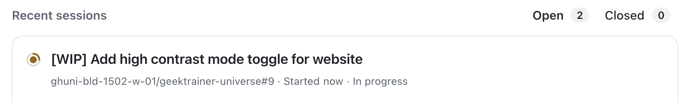

# Exercise 6 - Monitoring agent tasks in mission control

| [← Previous lesson: Custom agents][previous-lesson] | [Next lesson: Reviewing coding agent →][next-lesson] |
|:--|--:|

As the number of agents assigned to various tasks grows we need a centralized location to monitor and guide our agents. [Mission control][mission-control] is built to support supporting your agents.

From mission control you can see all sessions, past and present. You can explore the operations performed, and even redirect an in-progress session to help guide it.

## Scenario

After assigning the agent to create a high-accessible mode, the team realized it would be a good time to add a light mode as well. Since work was already being done to update the style of the site and add toggle functionality, it seemed logical to include this functionality. You want to update the agent's work to ensure it introduces this update.

In this lesson you will:

- explore mission control to monitor coding agent sessions.
- redirect an in-flight session to request additional functionality.

## Review Copilot coding agent sessions

Let's start by seeing the tasks we've already assigned to GitHub Copilot coding agent in mission control.

1. Navigate to mission control at [https://github.com/copilot/agents](https://github.com/copilot/agents).
2. Note the list of sessions, both on the main pane and on the left pane. You should see the list of the tasks you've assigned to Copilot, including:
    - Updating documentation for your codebase.
    - Generating APIs for modifying products.
    - Adding a high contrast mode for the website.
3. Select one of the running sessions. Review the tasks which have been performed by Copilot. These can include:
    - Checking out the code from the repository.
    - Creating the environment for Copilot to work.
    - Setting up MCP servers.
    - Performing various steps to complete the assigned task.

> [!NOTE]
> The exact steps listed will vary depending on the state of Copilot's work and the approach it took.

4. Also note the pull request (PR) pane which appears on the right side. This allows you to see the PR and files changed for additional monitoring.

## Redirect coding agent

Now that we've seen the sessions which are active, let's request Copilot include the light mode toggle while it works on the high-contrast mode.

1. Select the session which refers to adding a high contrast mode. The exact title will vary depending on the name Copilot uses and the current state of work.

    

2. Watch the session for a few of minutes, until it indicates it's completed the setup and begun its work. You'll know this has happened when you start seeing messages similar to the ones below.


3. In the **Steer active session while Copilot is working** dialog, add the following prompt:

    ```
    While we are working on a high contrast mode, let's also add a light mode.
    ```

4. Press <kbd>Enter</kbd> to send the prompt.
5. Notice how Copilot acknowledges the prompt and includes it in its flow.

## Let Copilot do its work

From here, Copilot will get to work on the updated task! This will take several minutes, so it's a good time to relax and reflect on everything you've learned and explored thus far.

## Summary and next steps

This lesson explored mission control, your central hub for monitoring and guiding GitHub Copilot coding agent sessions. With mission control you can track all active and completed sessions, review the work being performed, and even redirect in-flight sessions to adjust scope or provide additional guidance.

You explored these concepts:

- explored mission control to monitor coding agent sessions.
- redirected an in-flight session to request additional functionality.

With Copilot completing its work on the accessibility features, we can now turn our attention to our next lesson, [reviewing the pull requests Copilot created][next-lesson]. Mission control provides visibility into agent work and enables dynamic collaboration with coding agents as they work on tasks.

## Resources

- [Mission control][mission-control]
- [Custom agents][custom-agents]

---

| [← Previous lesson: Custom agents][previous-lesson] | [Next lesson: Reviewing coding agent →][next-lesson] |
|:--|--:|

[mission-control]: https://github.blog/changelog/2025-10-28-a-mission-control-to-assign-steer-and-track-copilot-coding-agent-tasks
[custom-agents]: https://docs.github.com/copilot/concepts/agents/coding-agent/about-custom-agents
[next-lesson]: ./7-reviewing-coding-agent.md
[previous-lesson]: ./5-custom-agents.md