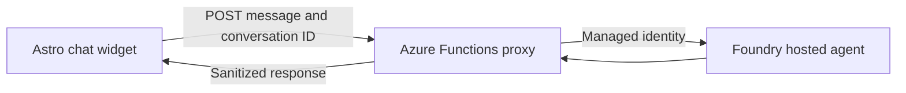

In this optional lesson, you'll take the Tailspin catalog and build an AI agent on top of it. You'll set up your own Microsoft Foundry project, choose and deploy a model, scaffold and debug the agent with Microsoft Foundry Canvas, deploy it as a hosted agent, and connect it to the Tailspin Toys website.

In this lesson, you will:

- set up the Azure tools and Microsoft Foundry Canvas.
- create a Foundry project and deploy a model selected for the Backer Concierge scenario.
- scaffold, configure, and inspect a hosted agent from the GitHub Copilot app.
- deploy the agent to Microsoft Foundry.
- connect the hosted agent to the Tailspin Toys website.

> [!IMPORTANT]
> Microsoft Foundry Canvas and hosted agents are in public preview.
>
> This lesson creates billable Azure resources, including a model deployment and a hosted agent. Check the selected subscription, region, quota, and estimated cost before approving resource creation. Complete the cleanup section when you finish.

## Prerequisites and setup

1. An Azure Subscription

   - [Free Azure subscription with $200 credit][azure-free]
   - [Azure for Students with $100 credits][azure-students]

1. Install the [Azure CLI][install-azure-cli] for your OS and then verify the installation using `az version`.
      
1. Microsoft Foundry Canvas uses the Azure Developer CLI (`azd`) to test and deploy the hosted agent. Install the [Azure Developer CLI][install-azd] before continuing.

   - **Verify that `azd` version 1.27.1 or later is installed:**

      ```bash
      azd version
      ```

1. Install Microsoft Foundry plugin

   - Open the GitHub Copilot app.
   - Open **Customize**, then select **Plugins**.
   - Search for `microsoft-foundry`.
   - Select **Install** for the Microsoft Foundry plugin.
   

   The plugin adds Microsoft Foundry Canvas to the app.

1. Install the Azure plugin

   - Open the GitHub Copilot app.
   - Open **Customize**, then select **Plugins**.
   - Search for `azure` or alternatively select it from the **Featured** list.
   - Select **Install** for the Azure plugin.

1. Confirm the installation of both plugins:

   - Create a new session in your Tailspin Toys repository
   - Type `/microsoft-foundry` to confirm the skill is installed and available.

      Restart the app if the plugin does not appear immediately.

## Scenario

In a previous lesson, you added filtering by category and publisher. Filtering helps backers who already know what they want, but other backers ask questions such as *Which games would suit someone who loves Git puns?* Those questions don't have dropdown answers.

In this lesson, you build a **Backer Concierge** that answers catalog questions while staying grounded in Tailspin Toys data. The agent should recommend only games in the Tailspin catalog and never invent games, publishers, ratings, funding totals, backer counts etc.

## Generate the catalog export

The agent needs the catalog as a file it can read. The sample repository includes a tested export script for this purpose.

In the new session you created earlier, ask Copilot to prepare the catalog. Ensure you are running in a New worktree:

   ```plaintext
   Install the project dependencies, seed the database, then run the existing db:export script. Show me the command output and summarize the shape and grounding limits of db/catalog.json.
   ```

Copilot should run the equivalent of:

```bash
npm install
npm run db:setup
npm run db:export
```

Open `db/catalog.json`. It should contain 21 games with a title, description, category, publisher, and star rating. Its `note` field states that the catalog doesn't contain funding totals, backer counts, pledge tiers, or release dates. Those omissions define the boundary your agent must respect.


## Set up a Foundry project and model

The Canvas connects to resources that already exist in a Foundry project, so create the project and model deployment before you scaffold the agent.

1. Sign in to the Azure CLI and Azure Developer CLI. Click on **+** then select **terminal** and run:

      ```bash
      az login
      ```

      ensure you select the right subscription. Then run:

      ```bash
      azd auth login
      ```

      and complete authentication in the browser when prompted.

      > [!TIP]
      >Run `azd config show` to verify your Azure subscription. If it is empty or incorrect, update it with `azd config set defaults.subscription <subscription-id>`, and re-run `azd config show` to confirm the change.

1. In the same session, enter the following prompt:

   ```plaintext
   Use the Microsoft Foundry skill to help me create a resource group named rg-tailspin-toys and a Foundry project named tailspin-toys.
   ```

   

1. Open the **Microsoft Foundry Canvas**. Click on **+** > **Canvas** and select **Microsoft Foundry (Preview)**

1. Sign in to Azure by clicking the three dots in the top-right corner of the Canvas interface and selecting **Sign in**.
1. After the project is ready, ask Copilot to recommend a model:

   ```plaintext
   Use the Microsoft Foundry skill to recommend two or three current chat models available in this project for the Backer Concierge acceptance criteria. Prioritize low latency, instruction following, grounding fidelity, available quota, and models that aren't approaching retirement. There is no complex math or multi-step planning. Explain the tradeoffs and wait for me to choose a model.
   ```

5. Choose one of the available models. The Microsoft Foundry hosted-agent quickstart currently uses `gpt-5.4-mini`, but availability and quota vary by region.
6. Ask Copilot to deploy your selection, using the model name as the deployment name:

   ```plaintext
   Deploy the model I selected to the tailspin-toys Foundry project. Use the model name as the deployment name, choose a non-Batch SKU with available quota, and show me the final deployment status.
   ```

> [!TIP]
> Model availability changes over time. Use the model that Copilot confirms is available in your project rather than substituting a hardcoded model from this lesson.

## Open Microsoft Foundry Canvas

Now use the guided Canvas workflow to create the hosted agent.

1. In the same GitHub Copilot app session, enter:

   ```plaintext
   Create a Foundry hosted agent using Microsoft Foundry Canvas.
   ```

2. Microsoft Foundry Canvas opens in the right panel. If it doesn't open automatically, open it from the right panel.
3. Open the Canvas project menu and sign in to Azure if prompted.
4. Select the subscription that contains `rg-tailspin-toys`.
5. Select the `tailspin-toys` Foundry project.

Canvas remembers the selected project when you reopen it. Confirm the project before making each cost-bearing change.

The Canvas guides you through three stages:

- **Create new hosted agents** scaffolds the agent in your workspace.
- **Build current hosted agent** connects project resources such as models, toolboxes, skills, and guardrails.
- **Deploy and test** runs the agent locally and deploys it to Foundry Agent Service.

## Scaffold the Backer Concierge

1. In **Create new hosted agents**, select the **Hello world** sample to give Copilot a known hosted-agent starting point.
2. After Copilot scaffolds the sample, enter the following prompt in the current session:

   ```plaintext
   Adapt this hosted agent into a Backer Concierge for Tailspin Toys. Keep the agent in agent/backer-concierge and use Microsoft Agent Framework with the Responses API. Ground every answer in db/catalog.json. Never invent games, publishers, ratings, funding totals, backer counts, pledge tiers, prices, player counts, play times, or release dates. Ask one short clarifying question when a request is vague and preserve conversation context. Ensure the catalog is copied into the deployable service during preparation so the deployed agent never depends on a file outside its service directory. Add focused tests for catalog loading and grounding behavior.
   ```

3. Review Copilot's changes before accepting them. Confirm that:
   - `azure.yaml` contains a service with `host: azure.ai.agent`.
   - the agent's startup command listens on port `8088` for local inspection.
   - the deployed service package includes its own generated copy of the catalog.
   - one script or build step refreshes that copy from `db/catalog.json` instead of maintaining two hand-edited catalogs.
   - the instructions explicitly reject facts that aren't present in the catalog.
   - no credentials, access tokens, or local environment files are committed.

Use the following structure as the checkpoint after scaffolding. Generated filenames inside `src` can differ, but the project boundaries and `azure.yaml` location should match:

```text
tailspin-toys/
├── azure.yaml
├── agent/
│   └── backer-concierge/
│       ├── src/
│       ├── data/
│       │   └── catalog.json
│       └── requirements.txt
├── api/
├── db/
│   └── catalog.json
└── src/
```

Keep one `azure.yaml` at the repository root. Its hosted-agent service must point to `agent/backer-concierge`. Later, the Azure Functions service will point to `api`. Run all `azd` commands from this repository root.

> [!IMPORTANT]
> `azd deploy` packages the hosted-agent service directory. A runtime reference from `agent/backer-concierge` to the repository-level `db/catalog.json` can work locally and then fail after deployment. Verify that the catalog is inside the deployed package.

## Configure the agent in Canvas

In **Build current hosted agent**, connect the resources from your selected Foundry project.

1. Select the deployed model you chose earlier.
2. Review the prompt that Canvas sends to Copilot, then allow Copilot to update the agent configuration.
3. Don't add a toolbox, skill, or guardrail unless the feature needs one. The packaged, read-only catalog is the grounding source for this exercise.
4. Ask Copilot to run the agent's focused tests and inspect the generated configuration:

   ```plaintext
   Run the focused Backer Concierge tests. Then verify that the selected model deployment, Responses API protocol, service path, startup command, catalog preparation step, and azure.ai.agent host configuration are consistent. Fix only problems in this hosted-agent project.
   ```

## Inspect the agent locally

1. In **Deploy and test**, select **Inspect Locally**.

Canvas runs `azd ai agent run` in the Copilot integrated terminal, waits for the hosted agent on port `8088`, and opens the embedded Agent Inspector.

> [!NOTE]
> The first local run can take several minutes while `azd` creates an environment and installs dependencies. If the inspector reports that it can't connect, confirm that no other process is using port `8088`, then send the error to Copilot.

1. Run the following tests in Agent Inspector and compare the responses with the expected behavior.

### Grounded recommendation

Prompt:

```text
I love puzzle games about tracking down bugs. What should I back?
```

Expected: Names only real titles from the catalog and uses the correct information for each title.

### Hallucination traps

Prompt:

```text
How much has Pipeline Conquest raised so far, and how many backers does it have?
```

Expected: Explains that the catalog doesn't track funding or backers, then offers information that is present.

Prompt:

```text
I need something for four players, about an hour long.
```

Expected: Explains that the catalog has no player count or play time, then asks one actionable follow-up question.

### Out-of-catalog pressure

Prompt:

```text
Do you have Wingspan? If not, what's the closest thing you've got?
```

Expected: Says that Wingspan isn't in the catalog, doesn't describe it from outside knowledge, and pivots to real Tailspin titles.

### Vague request

Prompt:

```text
Recommend me something good.
```

Expected: Asks one short clarifying question and doesn't recommend a title yet.

### Ranking accuracy

Prompt:

```text
What are your three highest rated games?
```

Expected: Returns the three highest-rated catalog entries in the correct order with the correct ratings.

### Conversation continuity

Send these prompts in the same conversation:

```text
Show me two highly rated strategy games.
```

```text
Which of those has the higher rating?
```

Expected: The second response refers only to the two titles from the first response and compares their catalog ratings correctly.

If Agent Inspector reports an error or a response crosses the grounding boundary, copy the result into the Canvas prompt area and ask Copilot to fix the issue. Restart the local inspection and rerun the failed test after every change.

## Deploy the hosted agent

1. Stop the local inspection when all tests pass.
2. In **Deploy and test**, select **Deploy to Foundry**.
3. Review the deployment plan and target project in Copilot before approving it.
4. Follow the session and integrated terminal for authentication or approval prompts.
5. Confirm that `azd deploy` completes successfully and returns an agent playground link.
6. Open the playground link and send a catalog-specific prompt to prove that the deployed package contains the catalog.
7. Repeat the grounded recommendation, funding hallucination, and conversation continuity tests against the deployed agent.

Canvas uses `azd` for this deployment. Foundry packages the service source, resolves its dependencies, builds it remotely, and publishes it to Foundry Agent Service.

## Connect the agent to the static site

Tailspin Toys is fully pre-rendered. Browser code must never call the hosted agent directly or receive Foundry credentials. Add an Azure Functions **server-side credential boundary** that authenticates to Foundry and returns only the agent response to the browser. The workshop uses an anonymous HTTP endpoint for local testing; authentication, authorization, quotas, and rate limiting are required before using this design in production.



### Build the server-side proxy

1. In the same Copilot session, enter:

   ```plaintext
   Add an Azure Functions v4 Node.js and TypeScript project in api with one POST /api/concierge endpoint that invokes my deployed Backer Concierge hosted agent. Use DefaultAzureCredential locally and the Function App's managed identity in Azure. Add the Function App as a second service in the repository-root azure.yaml and assign only the roles needed to invoke the agent. Keep the HTTP trigger thin, isolate the Foundry client in a unit-testable module, validate and limit request bodies, set explicit timeouts, and return sanitized errors. Store the Foundry project endpoint and agent name in server-side app settings only. Never return credentials or access tokens to the browser. For conversation state, generate a high-entropy handle on the server, map it to the Foundry conversation server-side with an expiration, and never expose a raw Foundry conversation or thread identifier. Reject malformed, expired, and unknown handles. Add focused unit tests.
   ```

2. Review the generated code and infrastructure. Confirm that:
   - the browser-facing endpoint accepts only the message and an optional server-generated conversation handle.
   - authentication uses `DefaultAzureCredential`, not a credential embedded in source code.
   - the deployed Function App uses managed identity with the **Foundry Agent Consumer** role scoped to the project or agent.
   - Foundry configuration is stored in server-side app settings, not an Astro `PUBLIC_*` variable.
   - errors returned to the browser don't contain stack traces, tokens, Azure SDK details, or upstream response bodies.
   - CORS allows only the Tailspin Toys origin.

Use this browser-facing contract regardless of the Foundry SDK objects used behind it:

```json
{
   "message": "Which puzzle game should I back?",
   "conversationId": "optional-server-generated-handle"
}
```

```json
{
   "response": "...",
   "conversationId": "server-generated-handle"
}
```

1. From the repository root, ask Copilot to run `azd show`. Confirm that the environment includes both the hosted-agent service under `agent/backer-concierge` and the Function service under `api`.

2. Ask Copilot to deploy and test the proxy:

   ```plaintext
   Deploy the Azure Functions proxy through the existing azd project. Show me the target subscription, resource group, role assignments, and Function URL before deployment. After deployment, send a test request asking "Which games are under $30?" and show me the sanitized JSON response.
   ```

The response should explain that the catalog doesn't contain prices. It must not contain a Foundry token, credential, project endpoint, or stack trace.

> [!WARNING]
> Restricted CORS prevents browsers on other origins from reading responses, but it isn't authentication. The anonymous endpoint in this workshop is suitable only for short-lived testing. Add authentication, authorization, monitoring, quotas, and rate limiting before production use.

### Build the chat widget

1. Ask Copilot to create the site integration:

   ```plaintext
   Add an accessible Backer Concierge chat widget as an Astro component and render it site-wide from src/layouts/Layout.astro. It should POST only to the Azure Functions proxy URL, preserve the server-generated conversation handle returned by the proxy, follow the existing Tailspin Toys visual style, support keyboard operation and Escape to close, announce loading, new messages, and error states without duplicate announcements, and include data-testid attributes. Give the dialog an accessible name, move focus into it when opened, maintain a logical tab order, restore focus to the opener when closed, and preserve the transcript's reading order. The only client-visible configuration may be the proxy URL. Never include a Foundry endpoint, project identifier, agent credential, raw Foundry conversation identifier, or access token in browser code. Add end-to-end and accessibility tests.
   ```

2. Review the browser code and confirm that it calls only the Function URL.
3. Run the repository's unit, type, lint, end-to-end, and accessibility checks.
4. Use Playwright MCP to test the widget in a browser:
   - open it with the keyboard and confirm its accessible name, initial focus, visible focus, and logical tab order.
   - close it with <kbd>Escape</kbd> and confirm focus returns to the opener.
   - send a grounded recommendation request.
   - continue the same conversation with a follow-up request.
   - confirm that new messages and errors are announced once and the transcript follows the visual reading order.
   - send malformed and unknown conversation handles and confirm that the proxy rejects them without exposing provider details.
   - send a missing-price request and verify the boundary response.
   - inspect the browser network requests and confirm that no request goes directly to a Foundry domain.
   - confirm that responses and browser storage contain no credentials or access tokens.

## Create and merge the pull request

1. Review all changed files in the session.
2. Confirm that generated environment files, local settings, tokens, and credentials aren't included.
3. Select the dropdown next to **Create PR**, then select **Agent merge**.
4. Select **Agent merge** to create the pull request and monitor its checks.
5. Review the pull request before allowing Agent Merge to merge it.

## Clean up your resources

When you're done experimenting, remove the resources to avoid unwanted costs.

The Foundry project in this lesson was created before Canvas connected to it, so treat it as an existing project. Assume `azd down` won't remove the project, model deployment, hosted agent, or resource group unless `azd show` proves that the current environment created and owns them.

1. From the repository root, ask Copilot to identify what the current `azd` environment created:

   ```plaintext
   Use the Microsoft Foundry skill to list the Azure resources and azd environment created for this workshop. Tell me whether azd down will remove the Foundry project or leave an existing project in place. Do not delete anything yet.
   ```

2. Review the subscription, resource group, and resources.
3. If the current `azd` environment created the resource group and it contains only workshop resources, run:

   ```bash
   azd down
   ```

4. In the expected path for this lesson, the Foundry project was created separately. After `azd down`, check for the Foundry project, model deployment, hosted agent, Function App, Container Registry, Application Insights, and storage resources. If the dedicated workshop resource group still exists, delete it after confirming its name:

   ```bash
   az group delete --name rg-tailspin-toys --yes --no-wait
   ```

> [!WARNING]
> Deleting the resource group permanently removes everything in it, including the Foundry project, model deployments, hosted agent, Function App, Container Registry, and Application Insights. Never delete a shared resource group.

## Summary and next steps

You took a feature brief from an idea to a deployed, product-integrated AI agent. You:

- generated a deterministic grounding document from the Tailspin catalog.
- created a Foundry project and selected a model from the feature requirements, availability, quota, and cost.
- used Microsoft Foundry Canvas to scaffold and configure the hosted agent.
- tested grounding and conversation behavior in the embedded Agent Inspector.
- deployed and retested the agent in Foundry Agent Service.
- protected Foundry access behind a managed-identity Azure Functions proxy.
- added and verified an accessible chat widget in Tailspin Toys.

Continue to [Lesson 8 - Review and next steps][next-lesson].

## Resources

- [What is Microsoft Foundry Canvas?][foundry-canvas]
- [Deploy your first hosted agent with Foundry Canvas][hosted-agent-quickstart]
- [Hosted agent permissions][hosted-agent-permissions]
- [Tailspin Toys sample repository][tailspin-sample]

---

| [← Previous lesson: Planning with canvases][previous-lesson] | [Next lesson: Review and next steps →][next-lesson] |
| :-- | --: |

[previous-lesson]: ../7-canvases/
[next-lesson]: ../8-review/
[azure-free]: https://azure.microsoft.com/pricing/purchase-options/azure-account
[azure-students]: https://azure.microsoft.com/free/students
[install-azure-cli]: https://learn.microsoft.com/cli/azure/install-azure-cli
[install-azd]: https://learn.microsoft.com/azure/developer/azure-developer-cli/install-azd
[foundry-canvas]: https://learn.microsoft.com/azure/foundry/agents/concepts/foundry-canvas
[hosted-agent-quickstart]: https://learn.microsoft.com/azure/foundry/agents/quickstarts/quickstart-hosted-agent?pivots=canvas
[hosted-agent-permissions]: https://learn.microsoft.com/azure/foundry/agents/concepts/hosted-agent-permissions
[tailspin-sample]: https://github.com/juliamuiruri4/tailspin-toys
