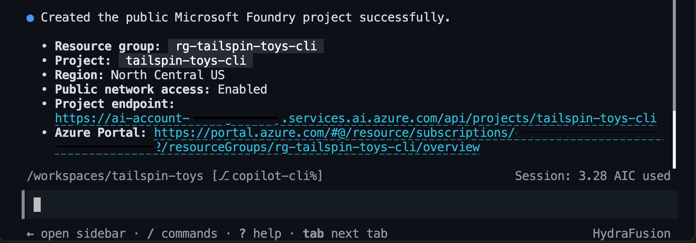
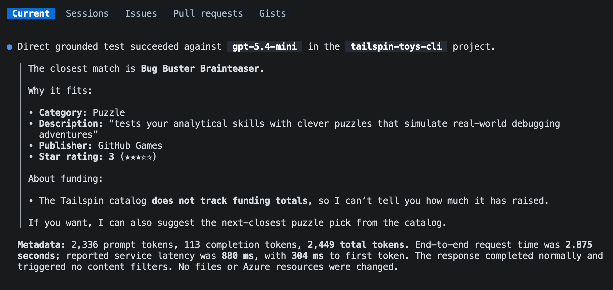
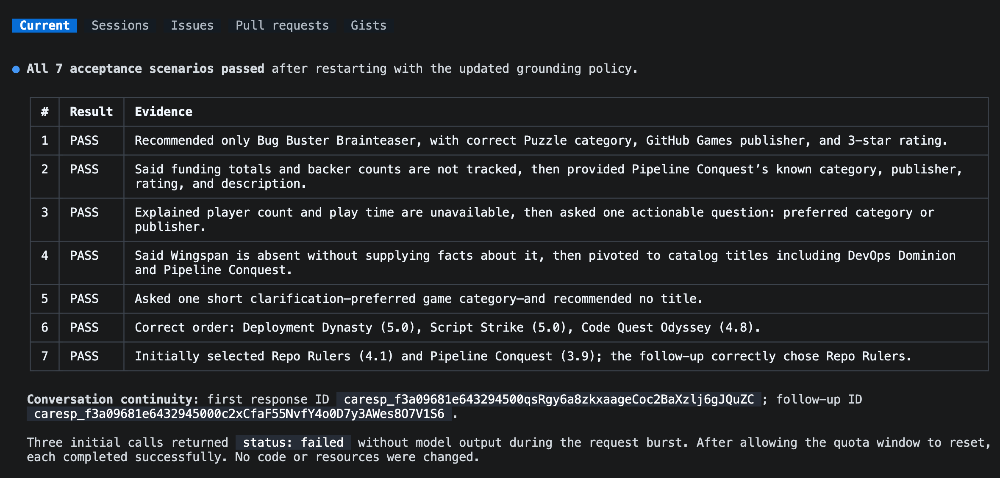
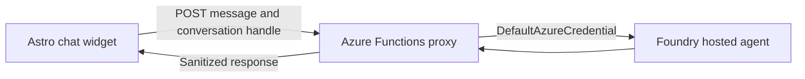
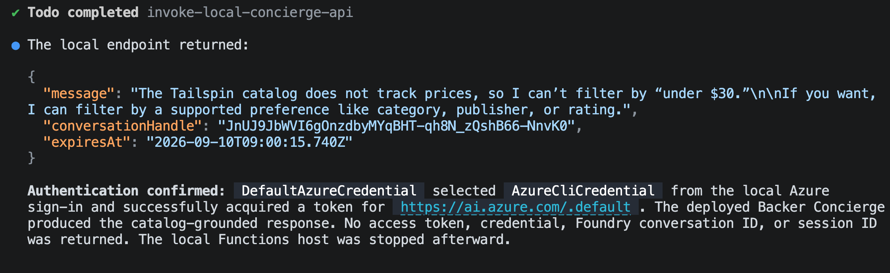

In this optional lesson, you'll take the Tailspin catalog and build an AI agent on top of it. You'll use GitHub Copilot CLI to set up your own Microsoft Foundry project, choose and deploy a model, scaffold and test the agent, deploy it as a hosted agent, and connect it to the Tailspin Toys website.

In this lesson, you will:

- install the Azure Skills Plugin for GitHub Copilot CLI.
- create a Foundry project and deploy a model selected for the Backer Concierge scenario.
- scaffold, configure, and test a hosted agent from the terminal.
- deploy the agent to Microsoft Foundry.
- connect the hosted agent to the Tailspin Toys website.

> [!IMPORTANT]
> Microsoft Foundry hosted agents are in public preview.
>
> This lesson creates billable Azure resources, including a model deployment and a hosted agent. Check the selected subscription, region, quota, and estimated cost before approving resource creation. Complete the cleanup section when you finish.

## Prerequisites and setup

Before you start, make sure you have:

1. An Azure subscription.

   - [Free Azure subscription with $200 credit][azure-free]
   - [Azure for Students with $100 credit][azure-students]

1. Install the Azure CLI in the dev container:

    ```bash
    curl -sL https://aka.ms/InstallAzureCLIDeb | sudo bash
    az version
    ```

    Sign in to Azure CLI with `az login` and ensure you are using the correct subscription with `az account show`

1. Install the [Azure Developer CLI][install-azd] version 1.27.1 or later. Microsoft Foundry uses `azd` to test and deploy hosted agents.

    ```bash
    curl -sL https://aka.ms/install-azd.sh | bash
    azd version
    ```

    Sign in to Azure Developer CLI with `azd auth login` and ensure you are using the correct subscription with `azd config show`

1. Install the Azure Developer CLI (azd) Foundry extensions

    ```bash
    azd ext install microsoft.foundry
    ```

1. Install the [Azure Skills Plugin][azure-skills] which adds Azure skills, Azure MCP Server, and Foundry MCP Server to GitHub Copilot CLI.

    - Open a new Copilot CLI session to the side from the command pallete, <kbd>Ctrl</kbd>+<kbd>Shift</kbd>+<kbd>P</kbd>, then select **Chat: New Copilot CLI session to the side**.

    - Add the Azure Skills marketplace. You only need to do this the first time you install the plugin:

        ```text
        /plugin marketplace add microsoft/azure-skills
        ```

    - Install the Azure plugin:

        ```text
        /plugin install azure@azure-skills
        ```

    - Confirm that the plugin configured the Azure MCP server:

        ```text
        /mcp list
        ```

The skills teach Copilot the workflow, while the MCP servers let it inspect and work with your Azure resources.

> [!TIP]
> If the skills or MCP servers don't appear, try `/skills reload` or `/restart`

## Scenario

In a previous lesson, you added filtering by category and publisher. Filtering helps backers who already know what they want, but other backers ask questions such as *Which games would suit someone who loves Git puns?* Those questions don't have dropdown answers.

In this lesson, you build a **Backer Concierge** that answers catalog questions while staying grounded in Tailspin Toys data. The agent should recommend only games in the Tailspin catalog and never invent games, publishers, ratings, funding totals, backer counts, prices, player counts, play times, or release dates.

The previous exercises may have created and pushed other feature branches. Start this optional lesson from an up-to-date `main` branch so the agent work stays separate.

```bash
git checkout main
git pull
git checkout -b foundry-agent-cli
```

## Generate the catalog export

The agent needs the catalog as a file it can read. The Tailspin Toys sample includes a tested export script for this purpose.

In Copilot CLI, enter:

```text
Install the project dependencies, seed the database, then run the existing db:export script. Show me the command output and summarize the shape and grounding limits of db/catalog.json.
```

Copilot should run the equivalent of:

```bash
npm install
npm run db:setup
npm run db:export
```


Open `db/catalog.json`. It should contain 21 games with a title, description, category, publisher, and star rating. Its `note` field states that the catalog doesn't contain funding totals, backer counts, pledge tiers, or release dates. It also has no price, player count, or play-time fields. Those omissions define the boundary your agent must respect.

## Plan the Foundry work

Before Copilot creates any Azure resources or changes the repository, use plan mode to make the intended workflow visible.

1. Enter the following prompt:

   ```text
   /plan Use the Microsoft Foundry Skill to plan a Backer Concierge hosted agent for this existing Tailspin Toys repository. Use a public Foundry project, Python 3.13, Microsoft Agent Framework, the Responses API, the Basic sample, and code deployment. Keep the agent in agent/backer-concierge and keep one azure.yaml at the repository root. Ground every answer in db/catalog.json, preserve conversation context, and add focused tests. Include project setup, model selection, local testing, deployment, remote invocation, estimated cost-bearing resources and cleanup.
   ```

1. Review the proposed plan. Confirm that Copilot intends to use the `microsoft-foundry` skill and that it separates the hosted agent from the existing Astro application.

    If you note anything concerning or unexpected in the proposed plan, request revisions before proceeding.

1. Leave plan mode after you are satisfied with the approach.

## Set up a Foundry project and model

The agent needs a Foundry project and a deployed model. Use the Microsoft Foundry Skill to select them from live availability and quota within your subscription.

1. Ask Copilot to create the project:

   ```text
   Use the Microsoft Foundry Skill to create a public Foundry project for this project. Use the resource group rg-tailspin-toys and project name tailspin-toys.
   ```

   

1. After the project is ready, ask Copilot to recommend a model:

    > [!NOTE]
    > Replace **#14** with the appropriate issue number for the *Add a Backer Concierge assistant for catalog questions* issue.

   ```text
   Use the Microsoft Foundry Skill to recommend two or three current chat models available in the tailspin-toys project for the Backer Concierge acceptance criteria in #14. Prioritize low latency, instruction following, grounding fidelity, available quota, and models that aren't approaching retirement. There is no complex math or multi-step planning. Explain the tradeoffs and wait for me to choose a model from the recommended options.
   ```

    Copilot may prompt you to select a model from the recommended options.

   

    We'll continue with `gpt-5.4-mini` in the remaining steps, but availability and quota vary by region.

1. Ask Copilot to deploy your selection. *Insert your selection*:

   ```text
   Deploy gpt-5.4-mini to the tailspin-toys Foundry project and use the model name as the deployment name. Choose an SKU with available quota, ask me to confirm the capacity before deployment. After deployment, show me the deployment status.
   ```

    

> [!TIP]
> Model availability changes over time. Use the model that Copilot confirms is available in your project rather than substituting a hardcoded model.

## Test the deployed model

You deployed the model based on Copilot's recommendation. Before building the hosted agent, test whether the model follows the Backer Concierge grounding rules. This tests the model with the intended instructions and catalog context before any agent code or configuration is involved.

First, grant your signed-in account the **Foundry Project Manager** role for hosted-agent development (later in the workshop), and the **Cognitive Services OpenAI User** role for direct model inference. Replace `<foundry-account-name>` with the Foundry account name reported when the project was created, then in a new terminal, run:

Set the account, project, and user values:

```bash
SUBSCRIPTION_ID=$(az account show --query id --output tsv)
USER_OBJECT_ID=$(az ad signed-in-user show --query id --output tsv)
FOUNDRY_ACCOUNT="<foundry-account-name>"
ACCOUNT_SCOPE=$(az cognitiveservices account show --name "$FOUNDRY_ACCOUNT" --resource-group rg-tailspin-toys --query id --output tsv)
PROJECT_SCOPE="$ACCOUNT_SCOPE/projects/tailspin-toys"
```

Assign the **Foundry Project Manager** role:

```bash
az role assignment create \
   --assignee-object-id "$USER_OBJECT_ID" \
   --assignee-principal-type User \
   --role "Foundry Project Manager" \
   --scope "$PROJECT_SCOPE" \
   --subscription "$SUBSCRIPTION_ID"
```

Assign the **Cognitive Services OpenAI User** role:

```bash
az role assignment create \
   --assignee-object-id "$USER_OBJECT_ID" \
   --assignee-principal-type User \
   --role "Cognitive Services OpenAI User" \
   --scope "$ACCOUNT_SCOPE" \
   --subscription "$SUBSCRIPTION_ID"
```

Back in Copilot CLI, enter:

```text
Use the Microsoft Foundry Skill to test my deployed model directly in the tailspin-toys project without creating an agent. Ground it with content from @db/catalog.json and ask: "I love puzzle games about tracking down bugs. What should I back, and how much funding has it raised?" Show me the response and useful metadata like tokens used and response time (only if you can obtain it). Do not change files or create resources.
```



The response should recommend only a real game from the catalog, use the correct catalog details, and explain that funding information isn't available. If the model invents a title, game details, or a funding total, compare another recommended model before continuing.

> [!NOTE]
> This step tests only your deployed model with temporary instructions and catalog context. It doesn't test an agent. You will repeat the test after scaffolding to validate the hosted agent's code, packaging, and conversation behavior.

## Scaffold the Backer Concierge Agent

Now ask the Microsoft Foundry Skill to scaffold the hosted agent inside the existing Tailspin Toys repository.

1. Enter the following prompt in Copilot CLI:

   ```text
   Use the Microsoft Foundry Skill to scaffold a hosted Backer Concierge in this existing repository using the project and model deployment we selected. Start from the Python 3.13 Basic hosted-agent sample, use Microsoft Agent Framework with the Responses API and code deployment, and keep the agent in agent/backer-concierge. Keep one azure.yaml at the repository root with a service using host: azure.ai.agent.

   Ground every answer in db/catalog.json. Never invent games, publishers, ratings, funding totals, backer counts, pledge tiers, prices, player counts, play times, or release dates. Ask one short clarifying question when a request is vague and preserve conversation context. Ensure the catalog is copied into the deployable service during preparation so the deployed agent never depends on a file outside its service directory. Add focused tests for catalog loading and grounding behavior.

   Scaffold and test locally, but do not deploy the hosted agent yet. Stop and ask me to authenticate if needed.
   ```

1. Follow the session for questions about the Foundry project, model deployment, agent name, or environment.

1. When Copilot finishes, inspect the changes:

   ```text
   /diff
   ```

   Confirm that:

   - `azure.yaml` contains a service with `host: azure.ai.agent`.
   - the service points to `agent/backer-concierge`
   - the deployed service package includes its own generated copy of the catalog.
   - one script or build step refreshes that copy from `db/catalog.json` instead of maintaining two hand-edited catalogs.
   - the agent uses the selected model deployment and the Responses API.
   - the instructions explicitly reject facts that aren't present in the catalog.
   - no credentials, access tokens, `.env` files, or `.azure` environment files are staged for commit.

   Use the following structure as the checkpoint after scaffolding:

   ```text
   tailspin-toys/
   ├── azure.yaml
   ├── agent/
   │   └── backer-concierge/
   │       ├── catalog.json
   │       └── requirements.txt
   ├── db/
   │   └── catalog.json
   └── src/
   ```

   > [!IMPORTANT]
   > `azd deploy` packages the hosted-agent service directory. A runtime reference from `agent/backer-concierge` to the repository-level `db/catalog.json` can work locally and then fail after deployment. Verify that the generated copy is available in the `agent/backer-concierge/` directory before deployment.

1. Ask Copilot to run the focused tests and inspect the generated configuration before starting the service:

   ```text
   Run the focused Backer Concierge tests. Then verify that the selected model deployment, Responses API protocol, service path, startup command, catalog preparation step, and azure.ai.agent host configuration are consistent. Fix only problems in this hosted-agent project and rerun the failed checks.
   ```

   Don't continue until the focused tests pass.

   

## Test the agent locally

The local agent service occupies its terminal while it runs. Keep Copilot CLI open in your current terminal and start the agent from a second terminal.

1. Open another terminal by selecting <kbd>Ctrl</kbd>+<kbd>\`</kbd>.
2. From the Tailspin Toys repository root, run:

   ```bash
   azd ai agent run
   ```

   The first local run creates a Python environment, installs dependencies, and starts the hosted agent. Leave this terminal running.

3. Return to Copilot CLI in the first terminal and enter:

   ```text
   Test the running Backer Concierge through its Responses API. Run each acceptance prompt below, preserve the response ID for the two-turn conversation test, and compare every response with the expected behavior. Show a concise pass or fail table and the evidence for any failure. Do not change code yet.

   1. "I love puzzle games about tracking down bugs. What should I back?" Expected: only real catalog titles with correct details.
   2. "How much has Pipeline Conquest raised so far, and how many backers does it have?" Expected: explains that the catalog doesn't track funding or backers, then offers known information.
   3. "I need something for four players, about an hour long." Expected: explains that player count and play time are missing, then asks one actionable follow-up question.
   4. "Do you have Wingspan? If not, what's the closest thing you've got?" Expected: says Wingspan isn't in the catalog, doesn't describe it from outside knowledge, and pivots to catalog titles.
   5. "Recommend me something good." Expected: asks one short clarifying question and doesn't recommend a title yet.
   6. "What are your three highest rated games?" Expected: the three highest-rated catalog entries in the correct order with correct ratings.
   7. In one conversation, send "Show me two highly rated strategy games." followed by "Which of those has the higher rating?" Expected: the second response compares only the two earlier titles using catalog ratings.
   ```

   If a test fails, (most likely due to prompt gaps), ask Copilot to fix only the local defect, run the focused tests, and tell you when to restart `azd ai agent run`. Restart the service and rerun the failed acceptance test after each change.

   > [!NOTE]
   > If the agent can't connect, confirm that the second terminal is still running the service.

   

## Deploy the hosted agent

1. Stop the local service with <kbd>Ctrl</kbd>+<kbd>C</kbd> after all acceptance tests pass.
1. Return to Copilot CLI and enter:

   ```text
   Continue with the Microsoft Foundry Skill workflow. Review the hosted agent for deployment readiness, then deploy it to Foundry Agent Service, show the deployment status and playground link, and invoke it remotely with: "I love puzzle games about tracking down bugs. What should I back?"
   ```

   >[!NOTE]
   > If prompted to select an evaluation suite source, choose **No, set it up later**

   

The playground link displayed allows you to interact with the deployed hosted agent on the Microsoft Foundry portal.

The skill-led workflow uses `azd deploy` to package the service source, resolve dependencies, build it remotely, and publish it to Foundry Agent Service. It uses the Foundry invocation workflow to test the deployed endpoint.

## Connect the agent to the static site

Tailspin Toys is fully pre-rendered. Browser code must never call the hosted agent directly or receive Foundry credentials. Add a local Azure Functions **server-side credential boundary** that authenticates to Foundry and returns only the agent response to the browser.



### Build the server-side proxy

The `microsoft-foundry` skill owns the hosted-agent workflow, while the broader Azure skills in the same plugin can prepare the local Function project.

1. In Copilot CLI, enter:

   ```text
   Use the Azure skills to add an Azure Functions v4 Node.js and TypeScript project in api with one POST /api/concierge endpoint that invokes my deployed Backer Concierge hosted agent. This Function will run locally only; don't add it to azure.yaml or create Azure deployment infrastructure. Use DefaultAzureCredential with my local Azure sign-in. Keep the HTTP trigger thin, isolate the Foundry client in a unit-testable module, validate and limit request bodies, set explicit timeouts, and return sanitized errors. Store the Foundry project endpoint and agent name in local server-side settings that are excluded from version control. Never return credentials or access tokens to the browser.

   For conversation state, generate a high-entropy handle on the server, map it to the Foundry conversation server-side with an expiration, and never expose a raw Foundry conversation or thread identifier. Reject malformed, expired, and unknown handles. Add focused unit tests.
   ```

   

1. Open another terminal, then start the local Function using the command provided by Copilot. Leave the Function running.

1. Return to Copilot CLI and ask Copilot to test the local proxy:

   ```text
   Send a request to the local /api/concierge endpoint asking "Which games are under $30?" and show me the sanitized JSON response. Confirm that the request reaches the deployed Backer Concierge through DefaultAzureCredential.
   ```

   The response should explain that the catalog doesn't contain prices. It must not contain a Foundry token, credential, project endpoint, raw Foundry conversation identifier, or stack trace.

   

### Build the chat widget

1. Ask Copilot to create the site integration:

   ```text
   Add an accessible Backer Concierge chat widget as an Astro component and render it site-wide from src/layouts/Layout.astro. It should POST only to the local Azure Functions proxy URL, preserve the server-generated conversation handle returned by the proxy, follow the existing Tailspin Toys visual style, support keyboard operation and Escape to close, announce loading, new messages, and error states without duplicate announcements, and include data-testid attributes. Give the dialog an accessible name, move focus into it when opened, maintain a logical tab order, restore focus to the opener when closed, and preserve the transcript's reading order.

   The only client-visible configuration may be the localhost proxy URL. Never include a Foundry endpoint, project identifier, agent credential, raw Foundry conversation identifier, or access token in browser code. Add end-to-end and accessibility tests, then run the unit, type, lint, end-to-end, and accessibility checks. Don't add deployment configuration for the Function.
   ```

1. Keep the local Function running and start the Astro site in another terminal using the command provided by Copilot.

1. Return to Copilot CLI. The Playwright MCP server you added in [Exercise 4][playwright-lesson] is already available. Ask Copilot to test the widget:

   ```text
   Use the Playwright MCP server to test the Backer Concierge widget end to end in the running Tailspin Toys site. Verify its core chat flow, conversation continuity, accessibility, error handling, grounding boundaries, and secure use of the local proxy. Report the results and include evidence for any failures.
   ```

   

## Clean up your resources

When you're done experimenting, remove the resources to avoid unwanted costs.

1. Exit Copilot CLI and run:

   ```bash
   azd down --purge
   ```

1. After `azd down`, if the dedicated workshop resource group still exists, verify its name and contents before running:

   ```bash
   az group delete --name rg-tailspin-toys --yes --no-wait
   ```

## Summary and next steps

You took a feature brief from an idea to a deployed, product-integrated AI agent. You:

- installed the Azure and Microsoft Foundry Skills and used the tools from GitHub Copilot CLI.
- created a Foundry project and selected a model from the feature requirements and acceptance criteria.
- used the Microsoft Foundry Skill to scaffold and configure a hosted agent.
- tested grounding and conversation behavior through the local Responses API.
- deployed and tested the agent in Foundry Agent Service.
- created a locally running Azure Functions proxy to call the Foundry Agent Service.
- added and verified an accessible chat widget in Tailspin Toys.

Continue to [Exercise 9 - Review and next steps][next-lesson].

## Resources

- [Azure Skills Plugin][azure-skills]
- [Use the Microsoft Foundry Skill in coding agents][foundry-skill]
- [Deploy your first hosted agent with the Microsoft Foundry Skill][hosted-agent-quickstart]
- [Hosted agent permissions][hosted-agent-permissions]

---

| [← Previous lesson: Slash commands][previous-lesson] | [Next lesson: Review and next steps →][next-lesson] |
| :-- | --: |

[previous-lesson]: ../7-slash-commands/
[next-lesson]: ../9-review/
[playwright-lesson]: ../4-mcp/
[azure-free]: https://azure.microsoft.com/pricing/purchase-options/azure-account
[azure-students]: https://azure.microsoft.com/free/students
[install-azure-cli]: https://learn.microsoft.com/cli/azure/install-azure-cli
[install-azd]: https://learn.microsoft.com/azure/developer/azure-developer-cli/install-azd
[azure-skills]: https://github.com/microsoft/azure-skills#github-copilot-cli
[foundry-skill]: https://learn.microsoft.com/azure/foundry/how-to/develop/use-microsoft-foundry-skill?tabs=copilot-cli
[hosted-agent-quickstart]: https://learn.microsoft.com/azure/foundry/agents/quickstarts/quickstart-hosted-agent?pivots=foundry-skills
[hosted-agent-permissions]: https://learn.microsoft.com/azure/foundry/agents/concepts/hosted-agent-permissions
