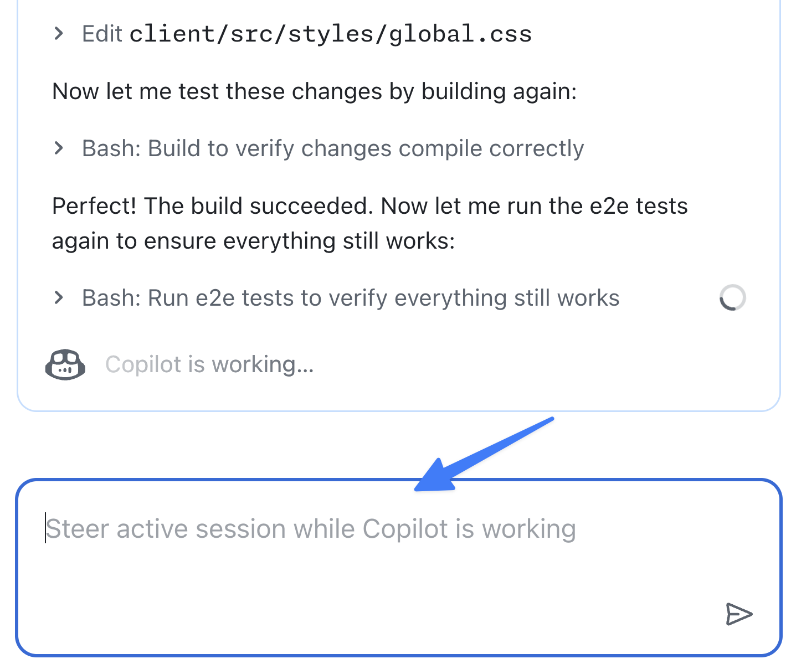

# Exercise 6 - Monitoring and managing agents

| [← Previous lesson: Custom agents][previous-lesson] | [Next lesson: Iterating on Copilot's work →][next-lesson] |
|:--|--:|

In the last couple of exercises you asked Copilot coding agent to take on three separate tasks focused on improving the user experience and adding functionality. While coding agent is built to operate asynchronously and autonomously, the ability to monitor these tasks is still important.

There are numerous tools available to you to manage tasks assigned to coding agent, including [the agents page][agents-page] on GitHub.com. From this mission control you can see all agent tasks with open pull requests (PRs). You can explore the operations performed, and even steer an in-progress session to help guide it.

In this lesson you will:

- explore the agents page to monitor coding agent tasks.
- steer an in-flight session to request additional functionality.

## Scenario

After assigning the agent to create a high-contrast mode, the team realized it would be a good time to add a light mode as well. Since work was already being done to update the style of the site and add toggle functionality, it seemed logical to include this functionality. You want to steer the agent's work to ensure it adds a light mode as well as high contrast.

## Review Copilot coding agent tasks

Let's see the current status of all tasks assigned to Copilot coding agent.

1. Navigate to agents page at [https://github.com/copilot/agents](https://github.com/copilot/agents).
2. Note the list of tasks, both on the main pane and on the left pane. You should see the list of the tasks you've assigned to Copilot, including:
    - Updating documentation for your codebase.
    - Generating APIs for modifying products.
    - Adding a high contrast mode for the website.
3. Select one of the running tasks. Review the tasks which have been performed by Copilot. These can include:
    - Checking out the code from the repository.
    - Creating the environment for Copilot to work.
    - Setting up MCP servers.
    - Performing various steps to complete the assigned task.

> [!NOTE]
> The exact steps listed will vary depending on the state of Copilot's work and the approach it took.

4. Also note the pull request (PR) pane which appears on the right side. This allows you to see the PR and files changed for additional monitoring.

## Steering coding agent

Now that you've seen the tasks which are active, let's request Copilot include the light mode toggle while it works on the high-contrast mode.

1. Select the session which refers to adding a high contrast mode. The exact title will vary depending on the name Copilot uses and the current state of work.

    

2. Watch the session for a few of minutes, until it indicates it's completed the setup and begun its work. You'll know this has happened when you start seeing messages similar to the ones below.
3. In the **Steer active session while Copilot is working** dialog, add the following prompt:

    ```
    While we are working on a high contrast mode, let's also add a light mode. There should be a switch for this mode as well where users can select their desired display mode.
    ```

    

4. Press <kbd>Enter</kbd> to send the prompt.
5. Notice how Copilot acknowledges the prompt and includes it in its flow.

## Let Copilot do its work

Just like before, Copilot will get to work on the updated task! It will incorporate the new request into its flow after it completes the particular step it's working on when you sent the message.

As before, this will take several minutes, so it's a good time to pause and reflect on everything you've learned and explored thus far.

## Summary and next steps

This lesson explored the Copilot agents page, your central hub for monitoring and guiding GitHub Copilot coding agent tasks. With this mission control you can track all active and completed tasks, review the work being performed, and even redirect in-flight tasks to adjust scope or provide additional guidance.

You explored these concepts:

- explored Copilot HQ and the agents page to monitor coding agent tasks.
- redirected an in-flight session to request additional functionality.

With Copilot completing its work on the accessibility features, we can now turn our attention to our next lesson, [iterating on the pull requests Copilot created][next-lesson]. Mission control provides visibility into agent work and enables dynamic collaboration with coding agents as they work on tasks.

## Resources

- [Copilot HQ agents page][agents-page]
- [Custom agents][custom-agents]

---

| [← Previous lesson: Custom agents][previous-lesson] | [Next lesson: Iterating on coding agent's work →][next-lesson] |
|:--|--:|

[agents-page]: https://github.blog/changelog/2025-10-28-a-agents-page-to-assign-steer-and-track-copilot-coding-agent-tasks
[custom-agents]: https://docs.github.com/copilot/concepts/agents/coding-agent/about-custom-agents
[next-lesson]: 
---

[next-lesson]: ./7-iterating-copilot-work.md
[previous-lesson]: ./5-custom-agents.md
